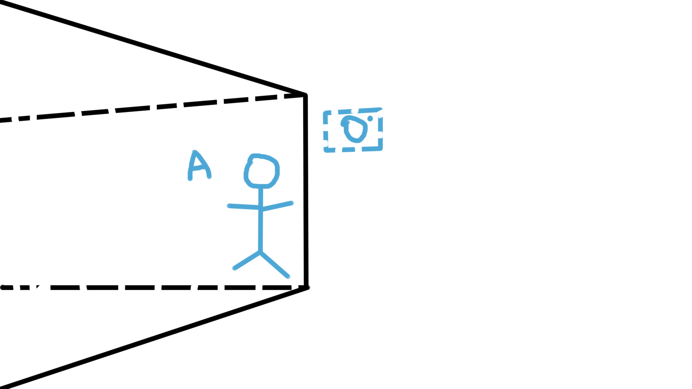
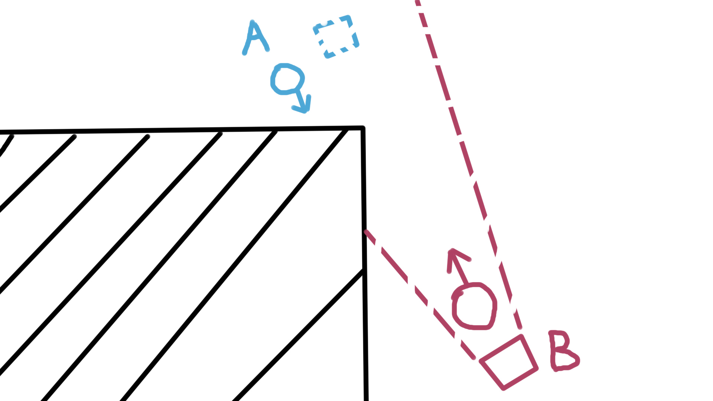
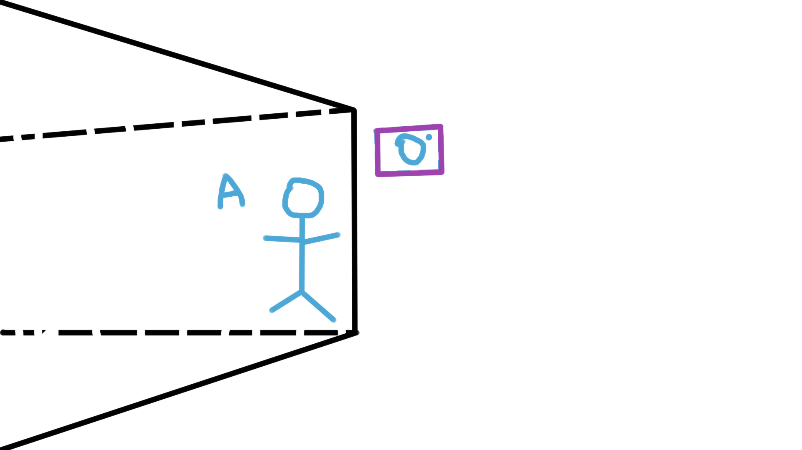
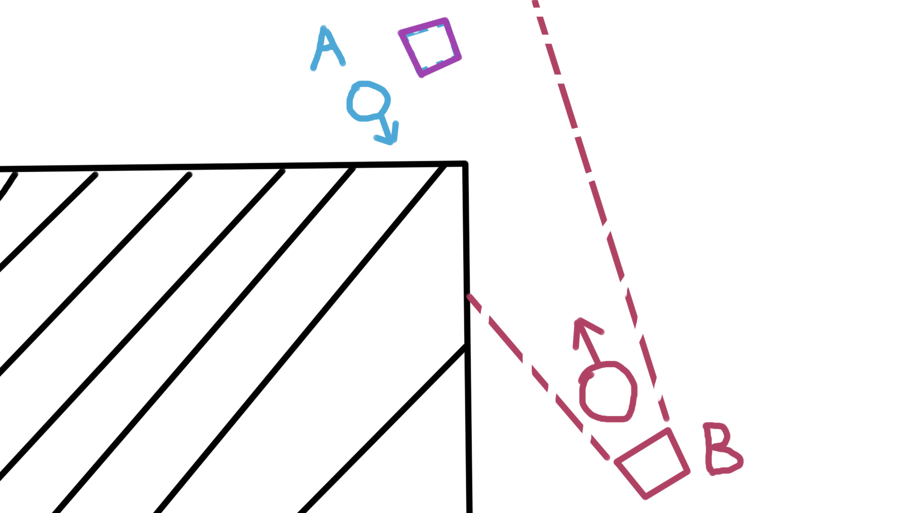
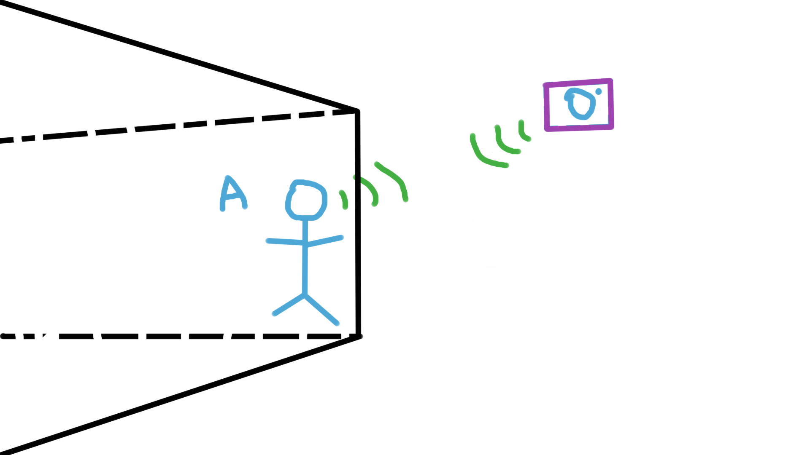
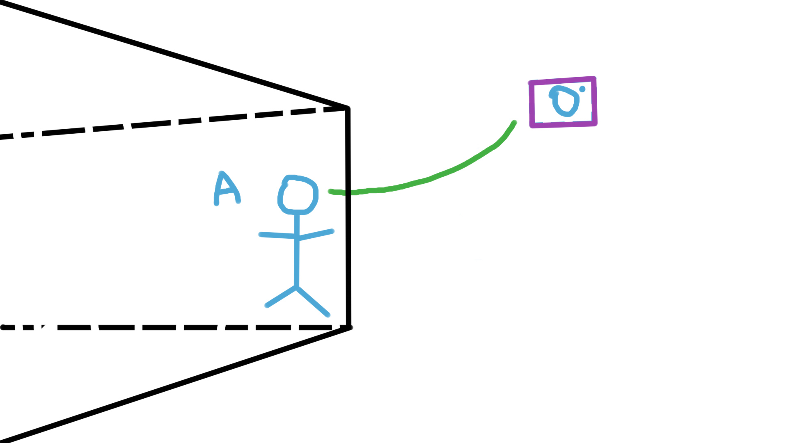
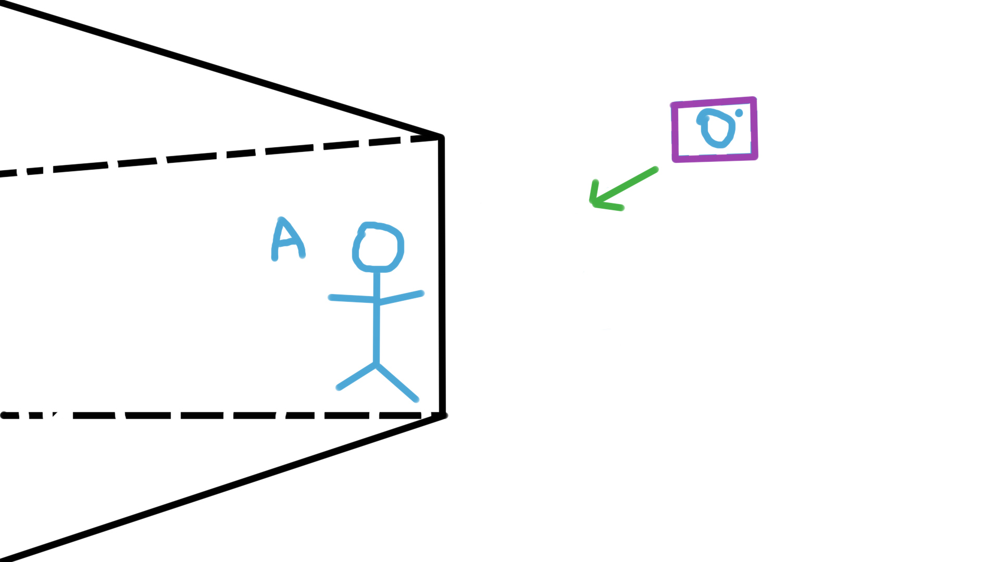
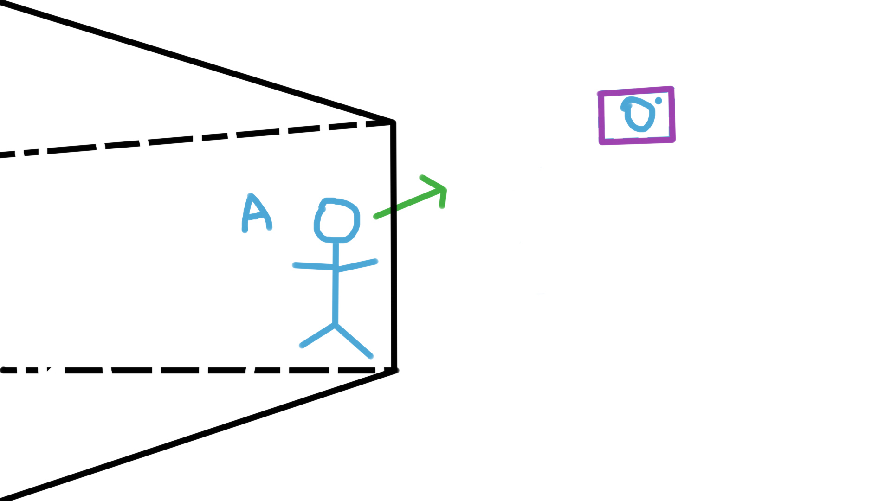

In previous games, camera of one players (Player-A) are invisible to another players(Player-B), this makes Player-A able to see player-B without himself or player-B seeing Player-A around certain corner/covers.
Thus, creating information asymmetry and gives Player-A unfair advantage.
This repo shows a solution to this problem by making previously invisible third-person cameras visible to players.

**Visible camera as a solution to information asymmetry / peek problem in Third-person games.**

**Problem to solve:** \
In previous games, camera of one players (Player-A) are invisible to another players(Player-B), this makes Player-A able to see player-B without himself or player-B seeing Player-A around certain corner/covers. Thus, creating information asymmetry and gives Player-A unfair advantage.

**What Player-B will see in current third person games** \

Player-A is behind a wall, thus invisible to player-B. \
Player-A’s camera is out of the wall, can see player-B. Player-B can not see the camera.

**A top view of situation** \

The player-A’s camera (invisible to player-B) is already out of the corner, but can provide vision of player-B to player-A without player-B be aware of anything about player-A.

**Solution:** \
To make the information which Player-B can access even. We make the usually invisible camera of Player-A visible to Player-B and any other players, so player-B can use the now visible camera of player-A to determine whether player-A can see him and where roughly player-A is. \

**What player-B will see** \

Player-A is behind a wall, thus invisible to player-B. \
Player-A’s camera is out of the wall, can see player-B. Player-B can now see the camera.

**A top view of situation** \

By making the camera of player-A visible to all players, player-B can see the camera of player-A. Thus, player-B will know he is seen by another player around the corner and is in potential danger. This will greatly reduce information asymmetry and improve fairness in third person games.

**Some variants of this idea to further reduce information asymmetry.** \
An all-player-visible objects like a wire, representation of radio wave communications, single directional arrow head could be used to further indicate precise position of player-A.  So player-B as well as any other players can know the position of player-A, if player-A’s camera is visible to them. \

\

Variant-1: A bi-directional radio wave icon to show the rough position of player-A to other players. \
\

Variant-2: A bi-directional wire representing the link between player-A and camera to show the rough position of player-A to other players. \
\

Variant-3: A single-directional arrow head to show the rough position of player-A to other players. \
\

Variant-4: A single-directional arrow head to show the rough position of player-A to other players. \
